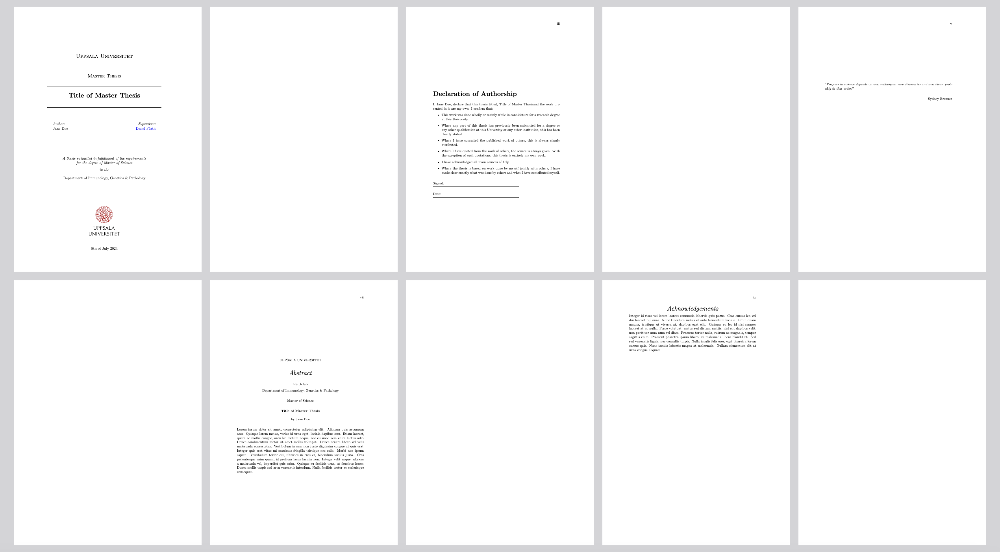
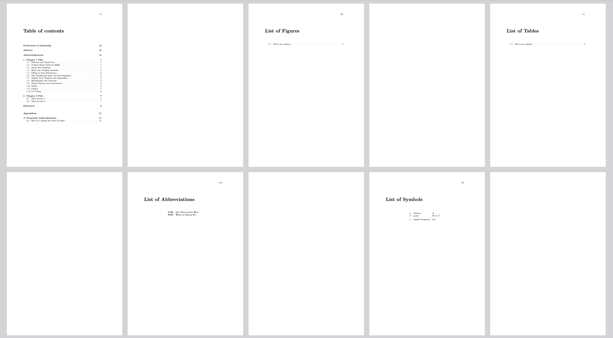

# Master thesis template  in Fürth lab

Quarto template to create your master thesis.






## Quick Start!

* Show me how to download a zip and open in RStudio: [Video](https://youtu.be/33l8GhtUfnU)
* Show me how to use this repo as a template and then clone to my computer with RStudio: [Video](https://youtu.be/smzNQtogSaI)
* Show me how to render in Visual Studio Code (see previous videos for how to get the repo onto your computer): [Video](https://youtu.be/IJe3A8-Ee2E)
* Scroll to the bottom for information on customizing the look of your thesis.


## Installing the extension

You will need to do this to get all the folders with tex files. Start in the directory where you will create the directory that will contain your thesis files. Run this from a terminal in that directory.

```bash
quarto use template furthlab/thesis_template
```

It will ask for an empty directory name where to put the files, give it a new directory name.

Once you do that you can cd to the new directory and render from within the directory.

```bash
quarto render
```

## Installation or updating for an existing document

You may also use this format with an existing Quarto project or document. But you will need to have all the tex folders already (see above).

```bash
quarto install extension furthlab/thesis_template
```

## Usage

### Customizing the look

For a LaTeX document, the class file `MasterDoctoralThesis.cls` in the `_extensions/quarto-thesis` determines the look and LaTeX environments available. To make any changes to the layout, change the MasterDoctoralThesis.cls **in the _extensions folder**. The `MastersDoctoralThesis.cls` file in the main folder will be overwritten by the one in the `_extensions` folder when you re-rerender.  To get info on the MasterDoctoralThesis document class, do a web search for `MasterDoctoralThesis.cls`. You'll find some documentation.

### Adding content

* start adding Chapters in qmd format to the Chapters folder.
* then add the chapter (or appendix) to the `_quarto.yml` file


## Getting and giving help

First try the Discussion link because there may be a solution there. Have a solution to post or want to show how you have used this template? Post to the discussion forum too! You'll find links to other Quarto thesis templates there too.

If you think it's a bug, then definitely post an issue and I'll look into it! 

## Contributors

This template is based on the [Masters/Doctoral Thesis, LaTeX Template, Version 2.5 (27 Aug 2017)](https://www.latextemplates.com/template/masters-doctoral-thesis). 

As well as: [nmfs-opensci/quarto-thesis](https://contrib.rocks/image?repo=nmfs-opensci/quarto-thesis)

## Problems

* All the stuff in Frontmatter is mandatory LaTeX since it is being injected into the tex document after the qmd is processed. Probably need to learn how to write a lua filter to render the Frontmatter qmd to LaTeX via Pandoc.

* I doubt that passing in `classoptions` in your `_quarto.yml` will work. The [elsevier lua filter](https://github.com/quarto-journals/elsevier/blob/main/_extensions/elsevier/elsevier.lua) suggests that the classoptions need to be added on.

* Why does `index-blx.bib` keep appearing?

## Warning. Chapter 1 has R code

Python and Julia users: After you install the extension, search for `{r}` in `Chapters/Chapter1.qmd` and get rid of the R code (for a table and a figure) or replace with Python or Julia code.
